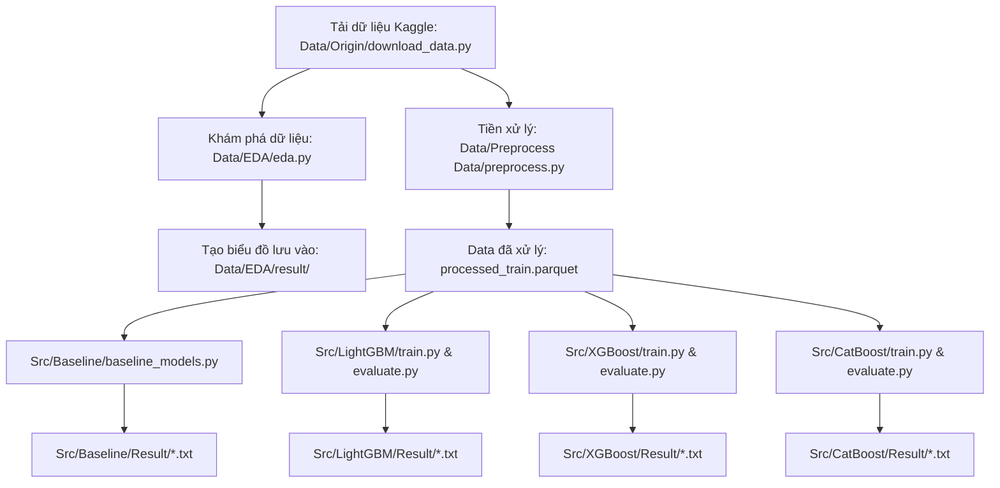

# Times Series Forecasting Using Machine Learning

Dự án nghiên cứu và triển khai bài toán **Dự báo chuỗi thời gian (Time Series Forecasting)** bằng phương pháp tiếp cận **Học máy dạng bảng (Tabular Machine Learning / Supervised Learning)** trên bộ dữ liệu bán lẻ kinh điển từ cuộc thi:
🔗 **[Walmart Recruiting - Store Sales Forecasting | Kaggle](https://www.kaggle.com/competitions/walmart-recruiting-store-sales-forecasting/data)**

---

## 📌 Mục lục
1. [Giới thiệu & Bản chất bài toán](#-giới-thiệu--bản-chất-bài-toán)
2. [Thông tin bộ dữ liệu Walmart Competition](#-thông-tin-bộ-dữ-liệu-walmart-competition)
3. [Cấu trúc thư mục dự án](#-cấu-trúc-thư-mục-dự-án)
4. [Cơ chế hoạt động & Pipeline xử lý](#-cơ-chế-hoạt-động--pipeline-xử-lý)
5. [Kỹ thuật đặc trưng (Feature Engineering)](#-kỹ-thuật-đặc-trưng-feature-engineering)
6. [Chiến lược Validation & Chống rò rỉ dữ liệu](#-chiến-lược-validation--chống-rò-rỉ-dữ-liệu)
7. [Mô hình hóa (Baseline & GBDT Models)](#-mô-hình-hóa-baseline--gbdt-models)
8. [Các thang đo đánh giá (Metrics)](#-các-thang-đo-đánh-giá-metrics)
9. [Hướng dẫn cài đặt & Thực thi từng bước](#-hướng-dẫn-cài-đặt--thực-thi-từng-bước)
10. [Lưu ý quan trọng khi làm việc với Git](#️-lưu-ý-quan-trọng-khi-làm-việc-với-git)

---

## 📖 Giới thiệu & Bản chất bài toán

Dự báo chuỗi thời gian là bài toán nhận diện **xu hướng (trend)**, **chu kỳ/thời vụ (seasonality)**, và các **yếu tố ngoại sinh (exogenous variables)** như giá cả, các chương trình khuyến mãi giảm giá, ngày lễ lớn từ dữ liệu lịch sử để dự đoán các giá trị tương lai.

* **Bản chất kỹ thuật:** Biến đổi bài toán chuỗi thời gian nhiều điểm đo (Multi-series) thành bài toán học có giám sát (Supervised Learning) bằng kỹ thuật trượt cửa sổ (Sliding/Rolling window): tạo các đặc trưng độ trễ (Lag features) và thống kê động (Rolling statistics).
* **Ưu thế của Tree-based GBDT (LightGBM, XGBoost, CatBoost):**
  * Xử lý tốt dữ liệu phi tuyến tính quy mô lớn (>400,000 dòng).
  * Dễ dàng kết hợp nhiều biến ngoại sinh (CPI, Fuel Price, Unemployment, MarkDown1-5, Size, Type) vào cùng một mô hình tổng thể duy nhất mà không cần giả định phân phối chuẩn như ARIMA.
* **Thách thức cốt lõi:** Ngăn chặn tuyệt đối hiện tượng rò rỉ dữ liệu thời gian (Lookahead bias/Data leakage), xử lý sự trôi dạt phân phối (Concept drift) do biến động vĩ mô, và các đợt bùng nổ doanh số ngày lễ (Thanksgiving/Black Friday, Christmas).

---

## 📊 Thông tin bộ dữ liệu Walmart Competition

Bộ dữ liệu được cung cấp bởi Walmart trên Kaggle gồm thông tin doanh số hàng tuần từ 45 cửa hàng và 81 phòng ban (Department) qua các tệp:

1. **`train.csv` (421,570 dòng):**
   * `Store`: Mã cửa hàng (1 -> 45).
   * `Dept`: Mã phòng ban (1 -> 99).
   * `Date`: Ngày kết thúc tuần bán hàng.
   * `Weekly_Sales`: Doanh số hàng tuần của từng phòng ban (Biến mục tiêu - Target).
   * `IsHoliday`: Tuần có rơi vào một trong 4 kỳ nghỉ lễ lớn hay không (`True`/`False`).

2. **`features.csv` (8,190 dòng):**
   * Thông tin ngoại sinh kinh tế và khí hậu theo từng cửa hàng:
   * `Temperature`: Nhiệt độ khu vực.
   * `Fuel_Price`: Giá xăng dầu địa phương.
   * `MarkDown1 - MarkDown5`: Dữ liệu ẩn danh liên quan đến các **chương trình khuyến mãi giảm giá** đặc biệt của Walmart (áp dụng từ tháng 11/2011).
   * `CPI`: Chỉ số giá tiêu dùng.
   * `Unemployment`: Tỷ lệ thất nghiệp khu vực.

3. **`stores.csv` (45 dòng):**
   * `Type`: Phân loại cửa hàng theo quy mô (`A`, `B`, `C`).
   * `Size`: Diện tích mặt sàn của cửa hàng.

4. **`test.csv` & `sampleSubmission.csv`:** Tập dữ liệu kiểm tra tương lai dùng để đánh giá nộp bài.

---

## 📁 Cấu trúc thư mục dự án

Toàn bộ dự án được tổ chức theo cấu trúc module hóa chuẩn mực:

```text
├── Config/
│   ├── __init__.py
│   └── config.toml               # Định nghĩa đường dẫn tương đối trỏ đến Data, Src, Checkpoint
│
├── Data/
│   ├── Origin/                   # Chứa code tải dữ liệu và thư mục con data
│   │   ├── download_data.py      # Code tự động tải và giải nén dữ liệu Walmart Competition
│   │   └── data/                 # Thư mục con CHỈ CHỨA dữ liệu thô gốc (.csv, .zip)
│   │       ├── train.csv
│   │       ├── features.csv
│   │       ├── stores.csv
│   │       └── test.csv
│   │
│   ├── EDA/                      # Khám phá và trực quan hóa dữ liệu
│   │   ├── eda.py                # Code phân tích Trend, Seasonality, Holidays, Exogenous
│   │   └── result/               # Thư mục lưu các biểu đồ đã phân tích (.png)
│   │
│   └── Preprocess Data/          # Tiền xử lý và kỹ thuật đặc trưng
│       ├── preprocess.py         # Code tạo Calendar, Lag 1-52, Rolling Mean/Std, encode
│       └── data/                 # Thư mục con CHỈ CHỨA dữ liệu đã qua tiền xử lý
│           └── processed_train.parquet
│
├── Metric/
│   ├── README.md                 # Tài liệu miêu tả chi tiết WMAE, MAE, RMSE, MAPE, R2
│   └── metrics.py                # Module chung tính toán các thang đo chuẩn
│
├── Src/
│   ├── Baseline/                 # Các mô hình cơ sở
│   │   ├── baseline_models.py    # Naive, Seasonal Naive, Moving Average
│   │   └── Result/               # Lưu file txt kết quả đánh giá baseline
│   │
│   ├── LightGBM/                 # Mô hình LightGBM
│   │   ├── train.py              # Code huấn luyện LightGBM có sample_weight theo WMAE
│   │   ├── evaluate.py           # Code dự báo và tính toán metric
│   │   ├── checkpoint/           # Thư mục lưu trọng số mô hình đã train (.pkl)
│   │   └── Result/               # Chứa file txt kết quả metric
│   │
│   ├── XGBoost/                  # Mô hình XGBoost
│   │   ├── train.py              # Code huấn luyện XGBoost (hist method, early stopping)
│   │   ├── evaluate.py           # Code đánh giá metric XGBoost
│   │   ├── checkpoint/           # Thư mục lưu checkpoint (.pkl)
│   │   └── Result/               # Chứa file txt kết quả metric
│   │
│   └── CatBoost/                 # Mô hình CatBoost
│       ├── train.py              # Code huấn luyện CatBoost với tối ưu categorical features
│       ├── evaluate.py           # Code đánh giá metric CatBoost
│       ├── checkpoint/           # Thư mục lưu model weights (.cbm, .pkl)
│       └── Result/               # Chứa file txt kết quả metric
│
├── README.md                     # Tài liệu tổng quan dự án
└── requirements.txt              # Danh sách các thư viện cần thiết
```

---

## ⚙️ Cơ chế hoạt động & Pipeline xử lý



---

## 🛠️ Kỹ thuật đặc trưng (Feature Engineering)

1. **Calendar / Temporal Features:**
   * `Year`, `Month`, `Week`, `Quarter`.
   * Đặc trưng tuần hoàn theo hình sin/cos:
     $$\text{Week\_sin} = \sin\left(\frac{2\pi \cdot \text{Week}}{52}\right), \quad \text{Week\_cos} = \cos\left(\frac{2\pi \cdot \text{Week}}{52}\right)$$
2. **Lag Features (Độ trễ):**
   * Được nhóm theo từng cặp `(Store, Dept)`:
   * Ngắn hạn: `sales_lag_1`, `sales_lag_2`, `sales_lag_4`, `sales_lag_8`.
   * Chu kỳ năm: `sales_lag_52` (doanh số tuần này năm trước, nắm bắt tính mùa vụ năm).
3. **Rolling Window Statistics (Thống kê động trượt):**
   * **Nguyên tắc chống rò rỉ dữ liệu:** Dữ liệu bắt buộc phải được `shift(1)` trước khi tính rolling:
     `sales.shift(1).rolling(w).mean()`
   * Cửa sổ 4 tuần (1 tháng): `rolling_mean_4`, `rolling_std_4`.
   * Cửa sổ 8 tuần & 12 tuần (1 quý): `rolling_mean_8`, `rolling_mean_12`, `rolling_std_12`.
4. **Biến ngoại sinh (Exogenous variables):**
   * Điền giá trị thiếu của `MarkDown1` -> `MarkDown5` bằng 0 (thể hiện tuần không có chương trình khuyến mãi giảm giá).
   * Mã hóa quy mô `Type` của cửa hàng (`A=1, B=2, C=3`) và diện tích mặt sàn `Size`.

---

## 🛡️ Chiến lược Validation & Chống rò rỉ dữ liệu

* **Không dùng K-Fold ngẫu nhiên:** Chuỗi thời gian có tính phụ thuộc thời gian, dùng K-Fold thông thường sẽ làm rò rỉ thông tin tương lai về quá khứ (Lookahead bias).
* **Phân chia theo mốc thời gian (Time-based Split):**
  * **Train Set:** Dữ liệu trước `2011-10-01` (dùng để mô hình học mẫu dữ liệu ban đầu).
  * **Validation Set:** Dữ liệu từ `2011-10-01` đến `2011-12-31` (giai đoạn vàng chứa mùa lễ Tạ Ơn, Black Friday, Giáng Sinh để mô hình tinh chỉnh trọng số).
  * **Test Set:** Dữ liệu từ `2012-01-01` trở đi (đánh giá khả năng dự báo trên tương lai hoàn toàn chưa biết).

---

## 🤖 Mô hình hóa (Baseline & GBDT Models)

1. **Baseline Models (`Src/Baseline`):**
   * **Naive:** Dự đoán doanh số tuần sau bằng đúng tuần trước ($y_t = y_{t-1}$).
   * **Seasonal Naive:** Dự đoán bằng doanh số cùng tuần năm ngoái ($y_t = y_{t-52}$).
   * **Statistical Model:** Moving Average 4 tuần gần nhất.
2. **LightGBM (`Src/LightGBM`):**
   * Cây quyết định tăng cường gradient với cơ chế Histogram và Leaf-wise.
   * Áp dụng `sample_weight` trực tiếp (gấp 5 lần cho tuần lễ) tối ưu hàm mục tiêu theo chuẩn WMAE.
3. **XGBoost (`Src/XGBoost`):**
   * Cây tăng cường gradient kiểm soát chặt chẽ hiện tượng quá khớp (overfitting) qua Regularization.
4. **CatBoost (`Src/CatBoost`):**
   * Xử lý nguyên bản các đặc trưng phân loại (`Store`, `Dept`, `Type`) thông qua Target Encoding động mà không làm nổ chiều dữ liệu.

---

## 📈 Các thang đo đánh giá (Metrics)

Chi tiết xem tại [`Metric/README.md`](file:///e:/Hcmut%20material/AI/Machine%20Learning/Times%20series%20forecasting%20using%20machine%20learning/Metric/README.md).

* **WMAE (Weighted Mean Absolute Error - Thang đo chính của Walmart):**
  $$\text{WMAE} = \frac{\sum_{i=1}^{n} w_i |y_i - \hat{y}_i|}{\sum_{i=1}^{n} w_i} \quad (w_i = 5 \text{ nếu Holiday, ngược lại } 1)$$
* **MAE (Mean Absolute Error):** Sai số tuyệt đối trung bình theo đơn vị USD.
* **RMSE (Root Mean Squared Error):** Phạt nặng các dự báo sai lệch lớn.
* **MAPE (%):** Tỷ lệ sai số phần trăm.
* **$R^2$ Score:** Khả năng giải thích phương sai của mô hình.

---

## 🚀 Hướng dẫn cài đặt & Thực thi từng bước

### Bước 1: Cài đặt môi trường

```bash
uv sync

uv pip install -r requirements.txt
```

### Bước 2: Tải dataset

```bash
python "Data/Origin/download_data.py"
```
*(Code tự động nhận diện token từ `kaggle.json`, tải và giải nén toàn bộ các tệp `train.csv`, `features.csv`, `stores.csv`, `test.csv` vào thư mục `Data/Origin/data`)*.

### Bước 3: Khám phá và phân tích dữ liệu (EDA)
```bash
python "Data/EDA/eda.py"
```
*(Các biểu đồ phân tích trend, seasonality, tương quan sẽ được lưu tự động trong `Data/EDA/result/`)*.

### Bước 4: Tiền xử lý dữ liệu & Tạo đặc trưng (Feature Engineering)
```bash
python "Data/Preprocess Data/preprocess.py"
```
*(Dữ liệu sau xử lý sẽ được lưu vào `Data/Preprocess Data/data/processed_train.parquet`)*.

### Bước 5: Chạy các mô hình Baseline
```bash
python "Src/Baseline/baseline_models.py"
```
*(Kết quả đánh giá được lưu tại `Src/Baseline/Result/baseline_metrics.txt`)*.

### Bước 6: Huấn luyện và đánh giá các mô hình Machine Learning

* **Huấn luyện và đánh giá LightGBM:**
  ```bash
  python "Src/LightGBM/train.py"
  python "Src/LightGBM/evaluate.py"
  ```
* **Huấn luyện và đánh giá XGBoost:**
  ```bash
  python "Src/XGBoost/train.py"
  python "Src/XGBoost/evaluate.py"
  ```
* **Huấn luyện và đánh giá CatBoost:**
  ```bash
  python "Src/CatBoost/train.py"
  python "Src/CatBoost/evaluate.py"
  ```

Tất cả checkpoint trọng số mô hình được lưu vào thư mục `checkpoint/` của từng mô hình, và toàn bộ báo cáo kết quả metric được xuất ra thư mục `Result/` tương ứng.

---

## ⚠️ Lưu ý quan trọng khi làm việc với Git

> [!IMPORTANT]
> **LUÔN TẠO NHÁNH (BRANCH) MỚI TRƯỚC KHI THỰC HIỆN `git add` VÀ `git commit`!**  
> Tuyệt đối không commit trực tiếp lên nhánh `main` hoặc `master` để tránh xung đột mã nguồn khi làm việc nhóm.

### Quy trình Git chuẩn:
1. **Kiểm tra trạng thái và tạo nhánh mới từ `main`:**
   ```bash
   # Đảm bảo đang ở main và đã cập nhật mới nhất
   git checkout main
   git pull origin main

   # Tạo và chuyển sang nhánh tính năng mới (đặt tên theo tính năng hoặc người làm)
   git checkout -b feature/<ten-tinh-nang>
   # Ví dụ: git checkout -b feature/eda-analysis hoặc feature/lightgbm-model
   ```

2. **Thực hiện code, sau đó add và commit trên nhánh vừa tạo:**
   ```bash
   git status
   git add .
   git commit -m "feat: mô tả công việc đã làm"
   ```

3. **Đẩy nhánh lên remote và tạo Pull Request (PR):**
   ```bash
   git push -u origin feature/<ten-tinh-nang>
   ```

