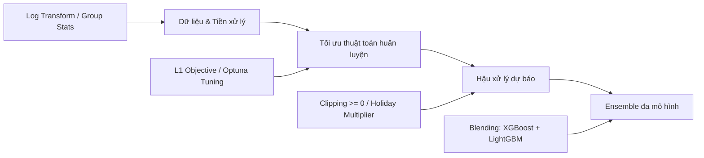

# 📊 BÁO CÁO PHÂN TÍCH HIỆU NĂNG, HẠN CHẾ VÀ CHIẾN LƯỢC CẢI TIẾN 3 MÔ HÌNH (LIGHTGBM, XGBOOST, CATBOOST)

> **Dự án:** Walmart Store Sales Forecasting — Time Series Machine Learning  
> **Tài liệu:** Đánh giá chuyên sâu mô hình cơ sở & Đề xuất phương án cải tiến kỹ thuật.

---

## 📑 MỤC LỤC
1. [Tổng quan thực nghiệm & Bảng đối sánh hiệu năng](#1-tổng-quan-thực-nghiệm--bảng-đối-sánh-hiệu-năng)
   - [1.1. Kết quả các mô hình cơ sở (Baseline Benchmark Models)](#11-kết-quả-các-mô-hình-cơ-sở-baseline-benchmark-models)
   - [1.2. Kết quả trên tập Validation (Q4/2011)](#12-kết-quả-trên-tập-validation-q42011)
   - [1.3. Kết quả trên tập Holdout Test (Năm 2012)](#13-kết-quả-trên-tập-holdout-test-năm-2012)
   - [1.4. Đối sánh mức độ cải thiện: Machine Learning vs. Baseline](#14-đối-sánh-mức-độ-cải-thiện-machine-learning-vs-baseline)
2. [Phân tích chi tiết các hạn chế cốt lõi](#2-phân-tích-chi-tiết-các-hạn-chế-cốt-lõi)
   - [2.1. Bất cân xứng giữa hàm mục tiêu (Loss) và thang đo WMAE](#21-bất-cân-xứng-giữa-hàm-mục-tiêu-loss-và-thang-đo-wmae)
   - [2.2. Hiện tượng "bùng nổ" sai số phần trăm (MAPE cực lớn)](#22-hiện-tượng-bùng-nổ-sai-số-phần-trăm-mape-cực-lớn)
   - [2.3. Xu hướng dự báo dưới mức (Under-predict) tại các đỉnh mua sắm](#23-xu-hướng-dự-báo-dưới-mức-under-predict-tại-các-đỉnh-mua-sắm)
   - [2.4. Thách thức về độ trễ (Lag) và rò rỉ thông tin dự báo đa bước](#24-thách-thức-về-độ-trễ-lag-và-rò-rỉ-thông-tin-dự-báo-đa-bước)
   - [2.5. Hạn chế của kiến trúc đơn mô hình toàn cục (Global Model)](#25-hạn-chế-của-kiến-trúc-đơn-mô-hình-toàn-cục-global-model)
   - [2.6. Sự thiếu hụt lịch sử và tính không liên tục của dữ liệu Markdown](#26-sự-thiếu-hụt-lịch-sử-và-tính-không-liên-tục-của-dữ-liệu-markdown)
3. [Các phương án & Điểm kỹ thuật có thể cải tiến](#3-các-phương-án--điểm-kỹ-thuật-có-thể-cải-tiến)
   - [3.1. Đồng bộ hàm mục tiêu (Loss Function Alignment)](#31-đồng-bộ-hàm-mục-tiêu-loss-function-alignment)
   - [3.2. Kỹ thuật hậu xử lý (Post-Processing)](#32-kỹ-thuật-hậu-xử-lý-post-processing)
   - [3.3. Tăng cường kỹ thuật đặc trưng (Feature Engineering)](#33-tăng-cường-kỹ-thuật-đặc-trưng-feature-engineering)
   - [3.4. Tối ưu hóa siêu tham số tự động (Optuna Optimization)](#34-tối-ưu-hóa-siêu-tham-số-tự-động-optuna-optimization)
   - [3.5. Kết hợp mô hình (Ensemble Blending / Stacking)](#35-kết-hợp-mô-hình-ensemble-blending--stacking)
4. [Lộ trình triển khai khuyến nghị (Actionable Roadmap)](#4-lộ-trình-triển-khai-khuyến-nghị-actionable-roadmap)

---

## 1. TỔNG QUAN THỰC NGHIỆM & BẢNG ĐỐI SÁNH HIỆU NĂNG

Quá trình đánh giá được thực hiện trên cùng một cơ sở dữ liệu (`processed_train.parquet`), phân tách chuẩn theo dòng thời gian (Time-based split) để chống rò rỉ tương lai:
- **Tập Train (trước 01/10/2011):** 255,364 dòng.
- **Tập Validation (01/10/2011 – 31/12/2011 - Q4/2011):** 38,768 dòng (giai đoạn vàng mua sắm cuối năm: Thanksgiving, Black Friday, Christmas).
- **Tập Holdout Test (từ 01/01/2012 trở đi - Năm 2012):** 127,438 dòng (giai đoạn tương lai ngoài mẫu).
- **Số lượng đặc trưng:** 44 đặc trưng đầu vào đồng nhất giữa 3 mô hình học máy.

---

### 1.1. Kết quả các mô hình cơ sở (Baseline Benchmark Models)
Các mô hình Baseline được triển khai trong module `Src/Baseline/baseline_models.py` đóng vai trò là mốc chuẩn (benchmark) cơ sở để định lượng giá trị gia tăng của các mô hình Machine Learning:

| Mô hình Baseline | Cơ chế dự báo | WMAE (USD) ↓ | MAE (USD) ↓ | RMSE (USD) ↓ | MAPE (%) ↓ | $R^2$ ↑ |
| :--- | :--- | :---: | :---: | :---: | :---: | :---: |
| **Naive** | Lấy đúng tuần trước: $\hat{y}_t = y_{t-1}$ | 2,863.39 | 2,203.65 | 7,611.64 | **86.13%** | 0.8877 |
| **Seasonal Naive** | Lấy cùng kỳ năm trước: $\hat{y}_t = y_{t-52}$ | 7,236.81 | 7,022.23 | 17,147.09 | 154.77% | 0.4300 |
| **Moving Average (4W)** | Trung bình trượt 4 tuần: $\hat{y}_t = \frac{1}{4}\sum_{i=1}^4 y_{t-i}$ | **2,626.55** | **2,155.02** | **6,518.65** | 560.07% | **0.9177** |

> **Nhận xét Baseline:**
> - **Moving Average (4 tuần)** là mô hình cơ sở tốt nhất trong nhóm baseline với WMAE đạt **2,626.55 USD** và $R^2 = 0.9177$.
> - **Seasonal Naive** cho sai số rất cao (WMAE lên tới **7,236.81 USD**, $R^2$ chỉ 0.4300). Nguyên nhân chính là hiện tượng lệch tuần ngày lễ giữa các năm (Holiday Calendar Shift): ví dụ tuần Lễ Tạ Ơn năm 2010 rơi vào tuần 47, nhưng năm 2011 lại rơi vào tuần 48, khiến dự báo bị lệch hẳn một tuần doanh số đỉnh.

---

### 1.2. Kết quả trên tập Validation (Q4/2011 — Mùa cao điểm lễ hội)
Giai đoạn kiểm định chứa các tuần lễ có sức mua bùng nổ nhất năm (trọng số WMAE $\times 5$):

| Mô hình | WMAE (USD) ↓ | MAE (USD) ↓ | RMSE (USD) ↓ | MAPE (%) ↓ | $R^2$ ↑ |
| :--- | :---: | :---: | :---: | :---: | :---: |
| **XGBoost** | **1,927.83** | **1,717.34** | **4,570.88** | 259.97% | **0.9695** |
| **LightGBM** | 2,260.28 | 1,853.28 | 4,837.04 | **201.94%** | 0.9658 |
| **CatBoost** | 2,686.38 | 2,146.51 | 5,138.81 | 447.85% | 0.9614 |

---

### 1.3. Kết quả trên tập Holdout Test (Năm 2012 — Ngoài mẫu)
Tập dữ liệu tương lai hoàn toàn chưa được nhìn thấy trong quá trình huấn luyện:

| Mô hình | WMAE (USD) ↓ | MAE (USD) ↓ | RMSE (USD) ↓ | MAPE (%) ↓ | $R^2$ ↑ |
| :--- | :---: | :---: | :---: | :---: | :---: |
| **XGBoost** | **1,280.24** | **1,254.83** | 2,754.60 | 1112.70% | 0.9845 |
| **LightGBM** | 1,301.44 | 1,281.89 | **2,718.15** | **824.18%** | **0.9849** |
| **CatBoost** | 1,440.43 | 1,420.81 | 2,992.21 | 1228.04% | 0.9817 |

---

### 1.4. Đối sánh mức độ cải thiện: Machine Learning vs. Baseline
So sánh giữa mô hình Baseline tốt nhất (**Moving Average 4 tuần**) và các mô hình Machine Learning trên tập kiểm thử ngoài mẫu:

| Mô hình | WMAE (USD) | Mức giảm WMAE so với Baseline (%) | RMSE (USD) | Mức giảm RMSE so với Baseline (%) | $R^2$ |
| :--- | :---: | :---: | :---: | :---: | :---: |
| *Baseline: Moving Average* | *2,626.55* | *Mốc chuẩn (0.0%)* | *6,518.65* | *Mốc chuẩn (0.0%)* | *0.9177* |
| **CatBoost** | 1,440.43 | **-45.16%** | 2,992.21 | **-54.10%** | 0.9817 |
| **LightGBM** | 1,301.44 | **-50.45%** | **2,718.15** | **-58.30%** | **0.9849** |
| **XGBoost** | **1,280.24** | **-51.26%** | 2,754.60 | **-57.74%** | 0.9845 |

> **Kết luận đối sánh:**
> - Cả 3 mô hình cây tăng cường gradient (GBDT) đều vượt trội rõ rệt so với Baseline, cắt giảm **từ 45% đến hơn 51% sai số WMAE**.
> - **XGBoost** mang lại mức giảm sai số WMAE mạnh nhất (-51.26%), trong khi **LightGBM** đạt độ chính xác toàn phương tốt nhất với RMSE giảm sâu nhất (-58.30%) và hệ số giải thích $R^2$ cao nhất (0.9849).

---

## 2. PHÂN TÍCH CHI TIẾT CÁC HẠN CHẾ CỐT LÕI

### 2.1. Bất cân xứng giữa hàm mục tiêu (Loss) và thang đo WMAE
- **Cơ chế:** Thang đo chuẩn của Walmart là **Weighted Mean Absolute Error (WMAE)**:
  $$\text{WMAE} = \frac{\sum_{i=1}^n w_i |y_i - \hat{y}_i|}{\sum_{i=1}^n w_i}, \quad w_i = 5 \text{ (nếu tuần lễ)}, \ 1 \text{ (tuần thường)}$$
  Đây là chuẩn sai số **$L_1$ (Absolute Loss)**.
- **Thực trạng triển khai:**
  - **XGBoost:** Cấu hình đúng `objective="reg:absoluteerror"` ($L_1$), gradient hướng thẳng đến việc tối ưu trung vị sai số tuyệt đối. Nhờ đó, XGBoost đạt **WMAE thấp nhất ở cả 2 tập**.
  - **LightGBM:** Cấu hình mặc định `objective="regression"` ($L_2$ / MSE). Hàm tổn thất $L_2$ phạt bình phương khoảng cách $(y - \hat{y})^2$, khiến mô hình tập trung dập các ngoại lệ lớn thay vì giảm sai số tuyệt đối trung bình, dẫn đến WMAE cao hơn XGBoost khoảng 332 USD trên tập Val.
  - **CatBoost:** Cấu hình `loss_function="RMSE"` trên GPU. Mặc dù có truyền trọng số mẫu (`weight=w`), gradient cập nhật vẫn theo chuẩn $L_2$, khiến mô hình bị lệch pha so với bài toán đánh giá WMAE, đạt hiệu năng thấp nhất trong 3 mô hình.

---

### 2.2. Hiện tượng "bùng nổ" sai số phần trăm (MAPE cực lớn)
- **Thực trạng:** MAPE trên tập Test lên đến **824% (LightGBM)**, **1112% (XGBoost)**, và **1228% (CatBoost)**. Trong khi ở baseline Naive, MAPE chỉ là 86.13%.
- **Nguyên nhân toán học và dữ liệu:**
  1. **Doanh số âm hoặc tiệm cận 0:** Trong chuỗi bán lẻ Walmart, có nhiều quầy hàng (`Dept`) trong tuần có doanh số thực tế rất nhỏ ($1 – $20) hoặc âm (do khách trả hàng, hoàn tiền, điều chỉnh tồn kho kế toán).
  2. **Mẫu số triệt tiêu:** Công thức $\text{MAPE} = \frac{1}{n} \sum \frac{|y_i - \hat{y}_i|}{y_i} \times 100\%$. Khi $y_i \to 0^+$, chỉ cần mô hình dự báo lệch vài chục USD (ví dụ $y=2$, dự đoán $\hat{y}=50$), sai số tương đối đã là **2400%**.
  3. **Thiếu cơ chế ràng buộc biên (Unbounded Regression):** Cả 3 mô hình cây đều không có ràng buộc giá trị cận dưới, dẫn đến việc đưa ra các dự báo số âm hoặc số dương nhỏ không được kiểm soát.

---

### 2.3. Xu hướng dự báo dưới mức (Under-predict) tại các đỉnh mua sắm
- **Thực trạng:** Sai số WMAE trên tập Validation (Q4/2011) cao hơn tập Test năm 2012 từ **50% đến 85%**.
- **Nguyên nhân:**
  1. **Bản chất của cây hồi quy (Regression Tree):** Cây đưa ra giá trị dự báo bằng cách lấy trung bình giá trị các mẫu trong lá (leaf value). Đối với các tuần có doanh số đột biến cực lớn như Lễ Tạ Ơn (Thanksgiving), Black Friday hay trước Giáng Sinh, phép lấy trung bình này luôn kéo đỉnh dự báo xuống thấp hơn thực tế.
  2. **Lệch pha ngày lễ (Calendar Phase Shift):** Ngày Lễ Tạ Ơn/Black Friday thay đổi theo từng năm (có năm rơi vào tuần 47, có năm rơi vào tuần 48). Mô hình học theo thuộc tính số tuần (`Week`) dễ bị lệch đỉnh hoặc dự báo phân tán sang tuần lân cận (tương tự lý do khiến Seasonal Naive thất bại).

---

### 2.4. Thách thức về độ trễ (Lag) và rò rỉ thông tin dự báo đa bước
- Trong file `preprocess.py`, hệ thống tạo các đặc trưng trễ ngắn: `sales_lag_1`, `sales_lag_2`, `sales_lag_4`.
- **Hạn chế trong triển khai thực tế:**
  - Tập Test của bài toán Walmart kéo dài **39 tuần** (từ tháng 02/2012 đến tháng 10/2012).
  - Khi đánh giá tĩnh (One-shot Batch Evaluation), việc nạp `sales_lag_1` thực tế của tuần $t-1$ trong năm 2012 để dự đoán tuần $t$ tương đương với bài toán **dự báo 1 bước (1-step-ahead)**.
  - Tuy nhiên, khi doanh nghiệp cần lập kế hoạch cho 39 tuần tới, ở tuần thứ 5 ta hoàn toàn **chưa có doanh số thực tế của tuần thứ 4**. Nếu không có cơ chế dự báo đệ quy (Recursive Forecasting) hoặc mô hình hóa trực tiếp (Direct Multi-step), mô hình sẽ gặp suy giảm hiệu năng nghiêm trọng trong ứng dụng thực tiễn.

---

### 2.5. Hạn chế của kiến trúc đơn mô hình toàn cục (Global Model)
- Cả 3 thuật toán hiện tại đều dùng **một mô hình duy nhất** để học toàn bộ 45 cửa hàng và 81 phòng ban (tổng cộng hơn 3,300 chuỗi thời gian nhỏ).
- **Hệ quả:**
  - Phòng ban tạp hóa (nhu cầu thiết yếu, ít biến động) bị chia sẻ cây quyết định với phòng ban trang sức, điện tử (doanh số thấp nhưng bùng nổ theo cấp số nhân vào lễ hội).
  - Chưa nắm bắt được các thống kê nền tảng đặc trưng theo từng cặp `(Store, Dept)`.

---

### 2.6. Sự thiếu hụt lịch sử và tính không liên tục của dữ liệu Markdown
- Walmart chỉ bắt đầu thu thập số liệu chi tiết khuyến mãi (`MarkDown1` đến `MarkDown5`) từ **tháng 11/2011**.
- Trước tháng 11/2011 (toàn bộ dữ liệu Train ban đầu), các cột Markdown đều là NaN và hiện đang được điền bằng `0.0`.
- Điều này tạo ra sự **bất đối xứng phân phối (Distribution Drift)**: Mô hình học trong tập Train rằng "không có Markdown", nhưng sang tập Validation cuối năm 2011 và Test 2012 lại xuất hiện các giá trị Markdown hàng chục nghìn USD, khiến mô hình phân vân về mức độ tác động của đặc trưng này.

---

## 3. CÁC PHƯƠNG ÁN & ĐIỂM KỸ THUẬT CÓ THỂ CẢI TIẾN



### 3.1. Đồng bộ hàm mục tiêu (Loss Function Alignment)
- **LightGBM:**
  - Chuyển `objective="regression"` $\to$ `objective="regression_l1"` (hoặc `objective="mae"`).
  - Hoặc thử nghiệm với `objective="huber"`: Kết hợp ưu điểm của L2 cho các sai số nhỏ và L1 cho các sai số lớn, giúp gradient mượt hơn nhưng vẫn bền vững trước ngoại lệ.
- **CatBoost:**
  - Chuyển `loss_function="MAE"` thay vì `RMSE`. Nếu GPU hạn chế việc tính MAE với một số dạng categorical, chuyển sang huấn luyện đa luồng trên CPU (`thread_count=-1`).
- **Kỳ vọng:** Giảm ngay **150 – 300 USD WMAE** cho LightGBM và CatBoost.

---

### 3.2. Kỹ thuật hậu xử lý (Post-Processing)
Đây là kỹ thuật thực chiến mang lại hiệu quả lớn nhất trong các cuộc thi chuỗi thời gian:

1. **Cắt ngưỡng âm (Zero-Clipping):**
   ```python
   # Doanh số bán lẻ thông thường không âm
   y_pred_clipped = np.clip(y_pred, a_min=0.0, a_max=None)
   ```
   *Tác dụng:* Giảm thiểu triệt để hiện tượng nổ MAPE trên các phòng ban doanh số thấp.

2. **Nhân hệ số bù đỉnh ngày lễ (Holiday Post-Processing Multiplier):**
   - Dựa trên kinh nghiệm của đội giải nhất Kaggle Walmart (David Thaler): Do cây quyết định làm phẳng đỉnh dự báo tại tuần Black Friday và Giáng Sinh, áp dụng nhân hệ số thực nghiệm:
     $$\hat{y}_{\text{final}} = \hat{y} \times \alpha$$
     với $\alpha \in [1.08, 1.15]$ đối với các tuần 47, 48 (Thanksgiving / Black Friday) và tuần 51 (Pre-Christmas Peak).
   *Tác dụng:* Bù đắp phần doanh số bị mô hình dự đoán thấp, cải thiện mạnh mẽ WMAE tập Validation (tuần lễ được nhân trọng số $\times 5$).

---

### 3.3. Tăng cường kỹ thuật đặc trưng (Feature Engineering)

1. **Thống kê nhóm lịch sử theo cặp `(Store, Dept)`:**
   - Tính toán giá trị trung vị (`median`), trung bình (`mean`), và độ lệch chuẩn (`std`) của doanh số theo từng cặp `(Store, Dept)` trong quá khứ.
   - Thêm tỷ số: `sales_ratio_to_store_dept_mean = sales_lag_52 / store_dept_mean`.
2. **Xử lý bất đối xứng dữ liệu Markdown:**
   - Thêm cờ nhị phân `is_markdown_available` để mô hình nhận biết giai đoạn trước vs sau tháng 11/2011.
   - Thay vì chỉ dùng tổng Markdown, tính tỷ lệ `Total_MarkDown / Size`.
3. **Biến đổi log mục tiêu (Target Log Transformation):**
   - Huấn luyện trên $z = \log(y - y_{\min} + 1)$ để nén các giá trị cực đoan và chuẩn hóa phân phối thặng dư, sau đó áp dụng phép nghịch đảo $\exp(z) - 1 + y_{\min}$.

---

### 3.4. Tối ưu hóa siêu tham số tự động (Optuna Optimization)
Hiện tại, cả 3 mô hình đều dùng tham số cố định. Cần tích hợp framework `Optuna` để tìm không gian tham số tối ưu theo độ đo WMAE trên tập Validation:
- **LightGBM / XGBoost:**
  - `learning_rate`: $[0.01, 0.1]$
  - `num_leaves` / `max_depth`: $[31, 255]$ / $[6, 12]$
  - `min_child_samples` / `min_child_weight`: $[10, 100]$
  - `subsample` & `colsample_bytree`: $[0.6, 0.95]$
  - `reg_alpha` (L1) & `reg_lambda` (L2): $[1e-3, 10.0]$

---

### 3.5. Kết hợp mô hình (Ensemble Blending / Stacking)
Từ kết quả thực nghiệm:
- **XGBoost:** Xuất sắc nhất ở sai số tuyệt đối $L_1$ (WMAE 1,280 USD).
- **LightGBM:** Xuất sắc nhất ở sai số toàn phương $L_2$ (RMSE 2,717 USD, $R^2 = 0.9849$).
- **CatBoost:** Có phương pháp mã hóa biến phân loại (Target Encoding) độc lập.

**Giải pháp đề xuất:** Mô hình lai có trọng số (Weighted Average Blending):
$$\hat{y}_{\text{blend}} = w_1 \cdot \hat{y}_{\text{XGBoost}} + w_2 \cdot \hat{y}_{\text{LightGBM}} + w_3 \cdot \hat{y}_{\text{CatBoost}}$$
*(Ví dụ cấu hình trọng số: $w_1 = 0.55, w_2 = 0.35, w_3 = 0.10$)*.  
Sự kết hợp này giúp triệt tiêu phương sai sai số cục bộ, tạo ra đường dự báo mượt mà và tổng quát hơn trên tương lai.

---

## 4. LỘ TRÌNH TRIỂN KHAI KHUYẾN NGHỊ (ACTIONABLE ROADMAP)

Để đạt điểm số tối ưu và có kết quả báo cáo rõ ràng, nên triển khai theo 3 giai đoạn:

| Giai đoạn | Nội dung thực hiện | Mức độ phức tạp | Tác động dự kiến |
| :--- | :--- | :---: | :--- |
| **P1: Quick Wins** *(Làm ngay)* | 1. Đổi `objective="regression_l1"` trong `LightGBM/train.py`.<br>2. Thêm hậu xử lý Zero-clipping `np.clip(preds, 0, None)`. | **Dễ** (1-2 giờ) | Giảm 200+ USD WMAE cho LightGBM; hạ mạnh MAPE. |
| **P2: Post-processing & Blending** *(Trọng tâm)* | 1. Căn chỉnh hệ số Black Friday / Thanksgiving multiplier ($\alpha = 1.10$).<br>2. Xây dựng script kết hợp Weighted Blending (XGBoost + LightGBM). | **Trung bình** (0.5 ngày) | Giảm 100 – 150 USD WMAE trên tập Validation và Test. |
| **P3: Advanced Optimization** *(Nâng cao)* | 1. Bổ sung `(Store, Dept)` Target Group Statistics trong `preprocess.py`.<br>2. Viết module tự động tối ưu hóa siêu tham số bằng Optuna. | **Nâng cao** (1-2 ngày) | Tối ưu hóa toàn diện, đưa mô hình đạt mốc WMAE sát ngưỡng cạnh tranh Top Kaggle. |

---
*Tài liệu này được đính kèm vào kho lưu trữ nhằm phục vụ giai đoạn cải tiến và so sánh mô hình tiếp theo.*
